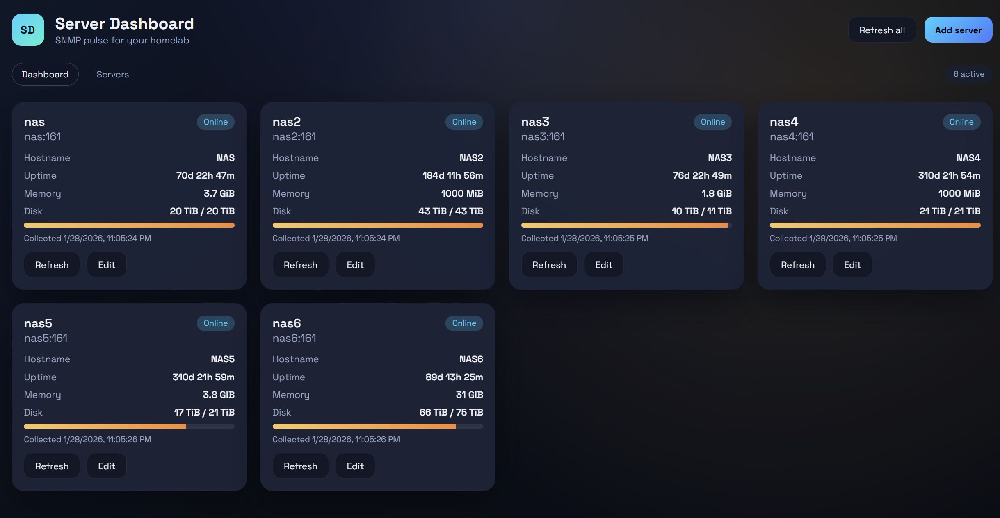

# Server Dashboard

Small, local-only dashboard for tracking servers via SNMP. Built with Vue 3 + Vite, Node/Express, and a JSON datastore.

## Features
- Add/edit servers (host, SNMP community, version, port)
- Live SNMP polling for hostname, uptime, memory, disk
- Local JSON storage for config + last stats (no native build deps)
- Single Docker container deployment



## Requirements
- SNMP enabled on each host (QNAP, Unraid, Ubuntu, etc.)
- SNMP community string configured and reachable from this dashboard host

## Local dev
From the repo root:

```bash
cd server
npm install
npm run dev
```

In another terminal:

```bash
cd web
npm install
npm run dev
```

Vite dev server will proxy `/api` to `http://localhost:3000`.

## Docker
Build and run:

```bash
docker compose up --build
```

Open `http://localhost:3000`.

## Config storage
- JSON database stored under `/data/db.json` inside the container.
- Data persists via the `server-dashboard-data` Docker volume.

## SNMP notes
The dashboard uses standard Host-Resources MIB OIDs to get memory and storage totals.
If a device reports storage differently, you may still see partial data for memory/disk.
